## Building CI/CD with Blue/Green and Canary Deployments on EKS using CDK

In this workshop you'll learn building a CI/CD pipeline (AWS CodePipeline) to develop a web-based application, containerize it, and deploy it on a Amazon EKS cluster. You'll use the blue/green method to deploy application and review the switchover using Application Load Balancer (ALB) Target-groups. You will spawn this infrastructure using AWS Cloud Development Kit (CDK), enabling you to reproduce the environment when needed, in relatively fewer lines of code.

The hosting infrastructure consists of pods hosted on Blue and Green service on Kubernetes Worker Nodes, being accessed via an Application LoadBalancer. The Blue service represents the production environment accessed using the ALB DNS with http query (group=blue) whereas Green service represents a pre-production / test environment that is accessed using a different http query (group=green). The CodePipeline build stage uses CodeBuild to dockerize the application and post the images to Amazon ECR. In subsequent stages, the image is picked up and deployed on the Green service of the EKS. The Codepipeline workflow is then blocked at the approval stage, allowing the application in Green service to be tested. Once the application is confirmed to be working fine, the user can issue an approval at the Approval Stage and the application is then deployed on to the Blue Service.

The Blue/Green architecture diagrams are provided below:

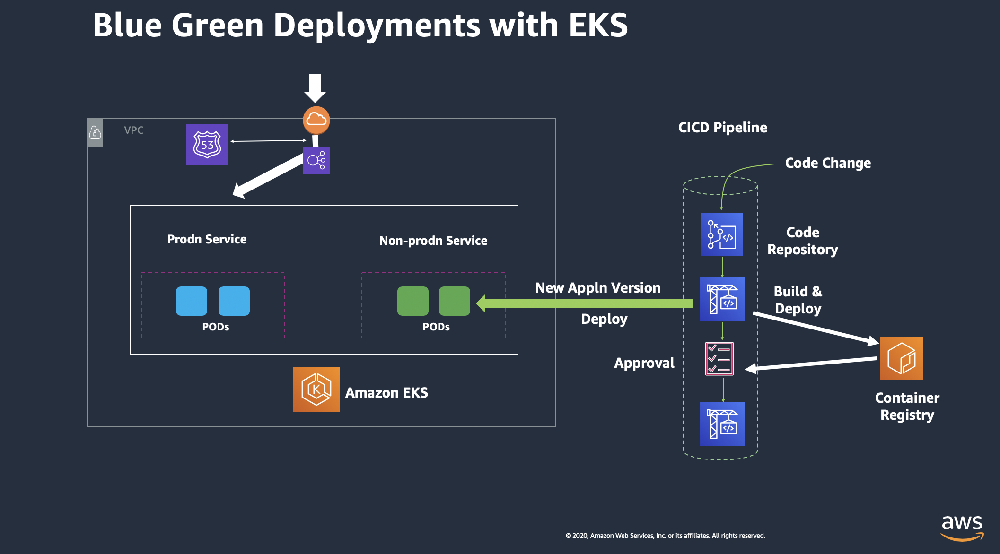
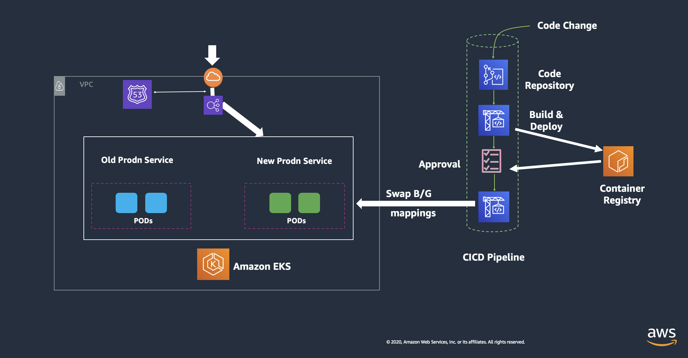
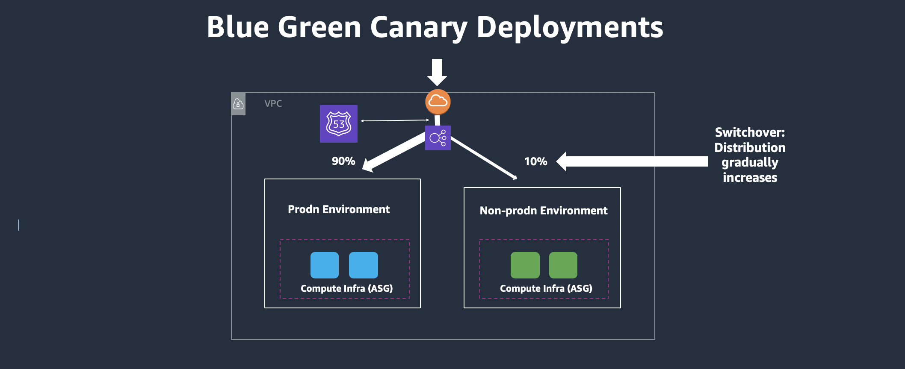

The CodePipeline would look like the below figure:

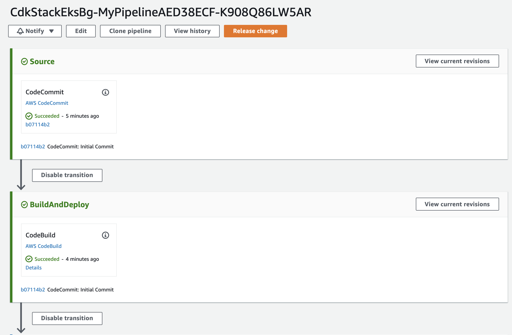
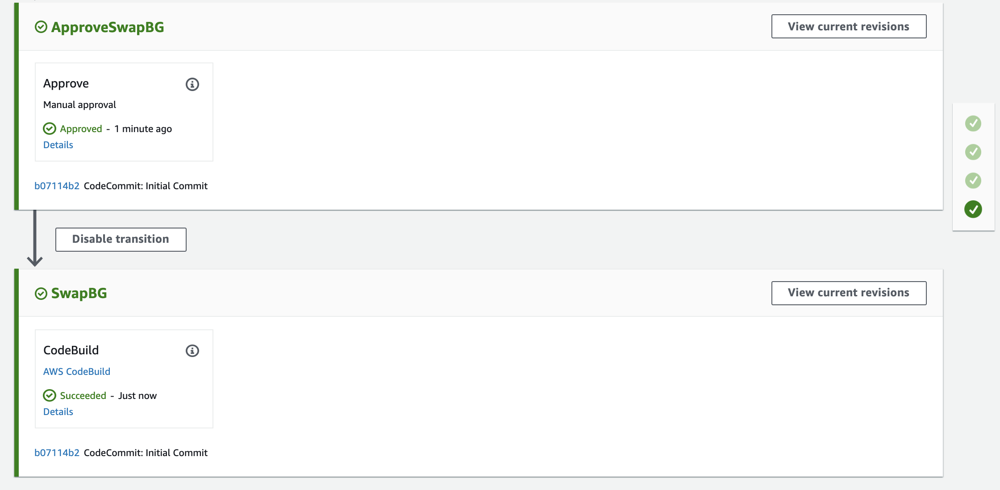

The current workshop is based upon this link and the CDK here is extended further to incorporate CodePipeline, Blue/Green Deployment on EKS with ALB. We will also use the weighted target-group to configure B/G Canary Deployment method. Note that currently CodeDeploy does not support deploying on EKS and thus we will instead use CodeBuild to run commands to deploy the Containers on Pods, spawn the EKS Ingress controller and Ingress resource that takes form of ALB. This workshop focuses on providing a simplistic method, though typical deployable model for production environments. Note that blue/green deployments can be achieved using AppMesh, Lambda, DNS based canary deployments too.

### Procedure to follow:

<b>Step1. Cloud9 and commands to run:</b>

First launch a Cloud9 terminal and prepare it with following commands:

```bash
sudo yum install -y jq
export ACCOUNT_ID=$(aws sts get-caller-identity --output text --query Account)
export AWS_REGION=$(curl -s 169.254.169.254/latest/dynamic/instance-identity/document | jq -r '.region')
echo "export ACCOUNT_ID=${ACCOUNT_ID}" | tee -a ~/.bash_profile
echo "export AWS_REGION=${AWS_REGION}" | tee -a ~/.bash_profile
aws configure set default.region ${AWS_REGION}
aws configure get default.region
```
Ensure the Cloud9 is assigned a role of an administrator and from Cloud9 -> AWS Settings -> Credentials -> Disable the Temporary Credentials
Now install kubectl package:

```bash
curl -LO https://storage.googleapis.com/kubernetes-release/release/v1.17.0/bin/linux/amd64/kubectl
chmod +x ./kubectl
sudo mv ./kubectl /usr/local/bin/kubectl
kubectl help
```
Prepare CDK prerequisite:

```bash
sudo yum install -y npm
npm install -g aws-cdk@1.124.0 --force
npm install -g typescript@latest
```
Run git clone on this repository from Cloud9:

```bash
git clone https://github.com/aws-samples/amazon-eks-cdk-blue-green-cicd.git amazon-eks-cicd-codebuild-eks-alb-bg
```

Once cloned, run the below commands:
```bash
cd amazon-eks-cicd-codebuild-eks-alb-bg
```

Note: For this workshop, we are using CDK version 1.30. If using the latest CDK version using "npm install -g aws-cdk" (without a version specification) then you would need to modify the EKS construct to include version number too.


```bash
git init
git add .
git commit -m "Initial Commit"
git status
git log
```
Now run the CDK steps as below:

```bash
cd cdk
cdk init
npm install
npm run build
cdk ls
```
Ensure the output is CdkStackEksALBBg

```bash
cdk synth
cdk bootstrap aws://$ACCOUNT_ID/$AWS_REGION
cdk deploy
```
You may be asked to confirm the creation of the roles and authorization before the CloudFormation is executed, for which, you can respond with a “Y”.

The infrastructure will take some time to be created, please wait until you see the Output of CloudFormation printed on the terminal. Until then, take time to review the CDK code in the below file: cdk/lib/cdk-stack.ts

You may also check and compare the CloudFormation Template created from this CDK stack:
cdk/cdk.out/CdkStackEksALBBg.template.json


<b> Step2: Configure EKS environment:</b>

Once the cdk is deployed successfully, go to the CloudFormation Service, select the CdkStackALBEksBg stack and go to the outputs section to copy the value from the field "ClusterConfigCommand".


Then paste this output into Cloud9 terminal to configure the EKS context.
Ensure you can see 2 nodes listed in the output of :
```bash
kubectl get nodes
```

Now configure the EKS cluster with the deployment, service and ingress resource as ALB using following set of commands:

```bash
cd ../flask-docker-app/k8s
ls setup.sh
chmod +x setup.sh
chmod +x setup2.sh
INSTANCE_ROLE=$(aws cloudformation describe-stack-resources --stack-name CdkStackALBEksBg | jq .StackResources[].PhysicalResourceId | grep CdkStackALBEksBg-ClusterDefaultCapacityInstanceRol | tr -d '["\r\n]')
CLUSTER_NAME=$(aws cloudformation describe-stack-resources --stack-name CdkStackALBEksBg | jq '.StackResources[] | select(.ResourceType=="Custom::AWSCDK-EKS-Cluster").PhysicalResourceId' | tr -d '["\r\n]')
echo "INSTANCE_ROLE = " $INSTANCE_ROLE 
echo "CLUSTER_NAME = " $CLUSTER_NAME
```

Note: Before proceeding further, confirm to see that both the variables $INSTANCE_ROLE and $CLUSTER_NAME have values populated. IF not, please bring it to the attention of the workshop owner, possibly the IAM role naming convention may have changed with the version.
Also, after EKS version 1.16 onwards, the k8 deploy API's using apps/v1beta1 is deprecated to apps/v1. The update has been made into the yaml files, however, if you are using an older version of EKS, you may need to modify this back.

```bash
./setup2.sh $AWS_REGION $INSTANCE_ROLE $CLUSTER_NAME
```

<b>Step3: Modify the ALB Security Group:</b>

Modify the Security Group (ControlPlaneSecurityGroup) for the newly spawned Application Load Balancer to add an incoming rule to allow http port 80 for the 0.0.0.0/0.
Services -> EC2 -> Load Balancer -> Select the latest created ALB -> Click Description Tab -> Scroll down to locate the Security Group Edit this security group to add a new rule with following parameters: http, 80, 0.0.0.0/0

Additionally, from EKS version 1.17 onwards, you would also need to change the security-group for Worker Nodes Data Plane (InstanceSecurityGroup) by adding an incoming rule to allow http port 80 for the ControlPlaneSecurityGroup (ALB).

Now, check the newly created LoadBalancer and review the listener routing rules: Services -> EC2 -> Load Balancer -> Select the latest created ALB -> Click Listeners Tab -> View/Edit Rules You would see the below settings shown:

Check the Load Balancer Target-groups and ensure the healthy hosts have registered and health check is consistently passing as shown below:

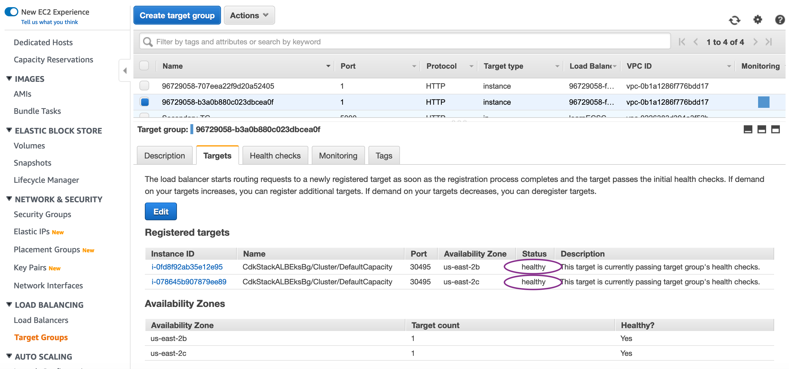

Check the healthy hosts count graph to ensure the hosts, containers are stable:

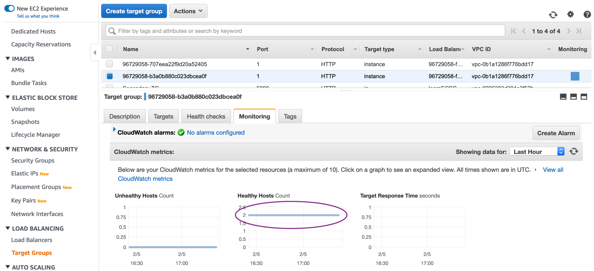

<b> Step4: Upload the Application to CodeCommit repo:</b>

Now that the ALB is setup, complete the last part of the configuration by uploading the code to CodeCommit repository:

```bash
cd ../..
pwd => confirm your current directory is amazon-eks-cicd-codebuild-eks-alb-bg
git add flask-docker-app/k8s/alb-ingress-controller.yaml
git add flask-docker-app/k8s/flaskALBIngress_query.yaml
git add flask-docker-app/k8s/flaskALBIngress_query2.yaml
git add flask-docker-app/k8s/iam-policy.json
git commit -m "Updated files"
git remote add codecommit https://git-codecommit.$AWS_REGION.amazonaws.com/v1/repos/CdkStackALBEksBg-repo
git push -u codecommit master
```

This will push the last commit we carried out in our preparation section, which in turn will trigger the CodePipeline.

### Review the Infrastructure:

Collect the DNS Name from the Load Balancer and access the homepage:

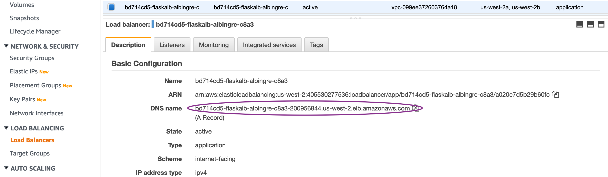

Once the Application is pushed to the Repository, the CodePipeline will be triggered and CodeBuild will run the set of commands to dockerize the application and push it to the Amazon ECR repository. CodeBuild will in turn run the kubectl commands to create the Blue and Green services on the EKS clusters, if it does not exist. For the first time, it will pull the Flask demo Application from the Dockerhub and deploy it on Blue as well as Green service. It should say "Your Flask application is now running on a container in Amazon Web Services" as shown below:

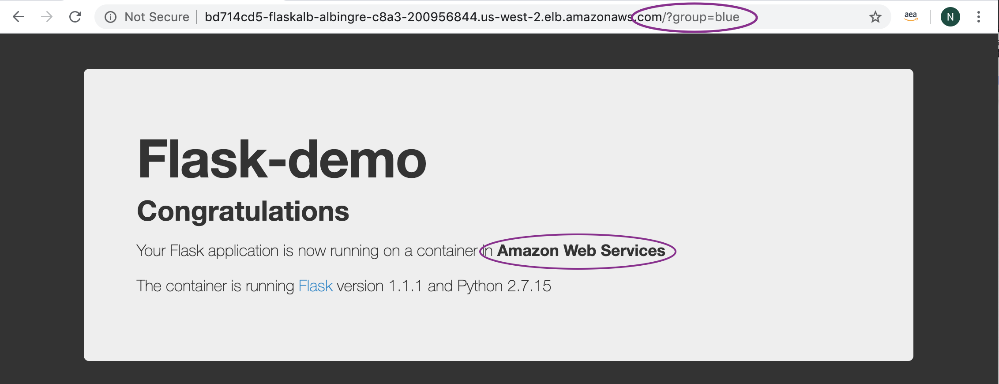
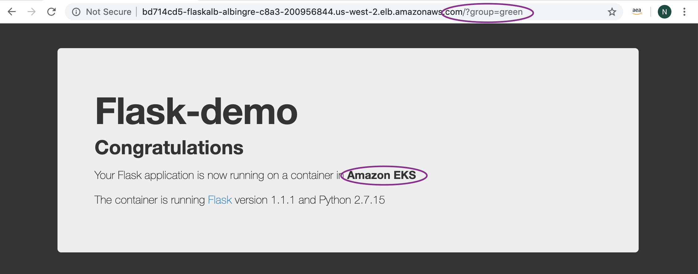


Go to Services -> CodePipeline -> Pipelines -> CdkStackEksALBBg-[unique-string]
Review the Stages and the CodeBuild Projects to understand the implementation.
Once the Application is deployed on the Green service, access it as mentioned above: http://ALB-DNS-name/?group=green.

It is important to note that container exposes port 5000, whereas service exposes port 80 (for blue-service) OR 8080 (for green-service) which in turn is mapped to local host port on the EC2 worker node instance.

After testing is completed, go to the Approval Stage and Click Approve. This will trigger the CodePipeline to execute the next stage to run the "Swap and Deploy" stage where it swaps the mapping of target-group to the blue / green service.


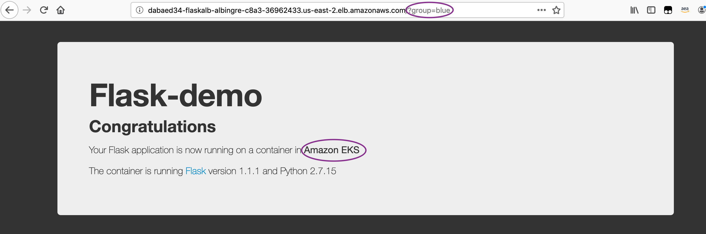
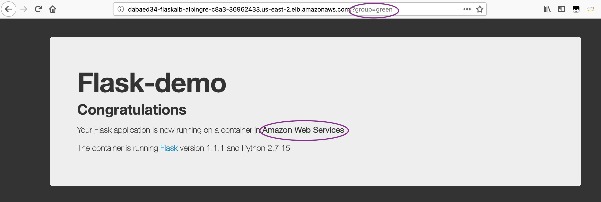


### Configuring for Canary Deployments:

Configure your ALB for Canary based deployments using below commands from your Cloud9 terminal:

```bash
cd /home/ec2-user/environment/amazon-eks-cicd-codebuild-eks-alb-bg/flask-docker-app/k8s
kubectl apply -f flaskALBIngress_query2.yaml
```

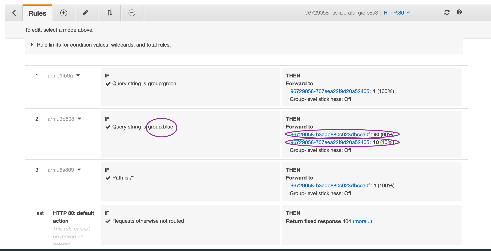

To bring the ALB config to the non-canary configuration, run the below commands:

```bash
cd /home/ec2-user/environment/amazon-eks-cicd-codebuild-eks-alb-bg/flask-docker-app/k8s
kubectl apply -f flaskALBIngress_query.yaml
```

### Cleanup

(a) Remove the EKS Services:
First connect to the kubernetes cluster using command published as "ConfigCommand" under CloudFormation output. Run "kubectl get svc" to check if you can see the Blue and Green services. Then run the below commands to delete the services.

```bash
kubectl delete svc/flask-svc-alb-blue svc/flask-svc-alb-green -n flask-alb
kubectl delete deploy/flask-deploy-alb-blue deploy/flask-deploy-alb-green -n flask-alb
kubectl delete ingress alb-ingress -n flask-alb
kubectl delete deploy alb-ingress-controller -n kube-system
```

(b) Destroy the CDK Stack:
Ensure you are in the cdk directory and then run the below command:

```bash
cdk destroy
```

(c ) Remove the individual created policies:
Access IAM Service, then access Roles, then select the Worker Node Instance role (search by CdkStackALBEksBg-ClusterDefaultCapacityInstanceRol) and then remove the inline elb-policy
Access IAM Service, then access Policies, then select “alb-ingress-controller” managed policy created for kubectl, then Select Policy Actions and Delete

### Conclusion:

We built the CICD Pipeline using CDK to containerize and deploy a Python Flask based application using the Blue/Green Deployment method on Amazon EKS. We made the code change and saw it propagated through the CICD pipeline and deploy on Blue/Green service of EKS. We also configured and tested B/G Canary Deployment method.

Hope you enjoyed the workshop!


## License

This library is licensed under the MIT-0 License. See the LICENSE file.
